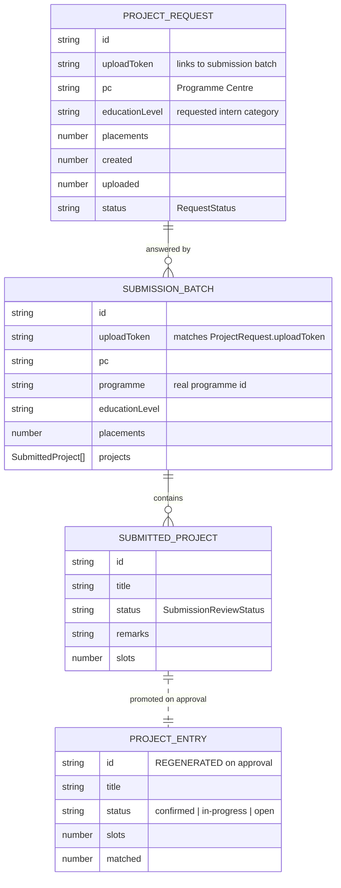

# A1 Project Request & Submission Data Flow

> Living document. Captures how a project request flows from IO creation → AD(P&C) submission → IO/DCE review → AD(P&C) resubmission / rejection / approval.
>
> Design reference: https://toademo.nttdatadm.com/TOA%20-%20Internship/flow-project-requests.html (password `NTTDATA0724`)
>
> Last updated: 2026-08-05 after `returnedForUpdate` status split from `rejected`.

---

## 1. Core Entities



---

## 2. Project Item Status Flow

`SubmissionReviewStatus` in `lib/types.ts`:

```ts
type SubmissionReviewStatus =
  | 'draft'
  | 'pending'
  | 'frozen'
  | 'approved'
  | 'rejected'
  | 'returnedForUpdate'
  | 'withdrawn';
```

### Flow diagram

```
[draft]                    ← AD (P&C) creates / uploads locally, not yet submitted
   │ Submit
   ▼
[pending]                  ← IO review queue (Submissions → Pending Review)
   │ Lock for Review (Freeze)
   ▼
[frozen]                   ← Pending DCE Approval (IO exports to DCE)
   │ IO records DCE outcome
   ├─► [approved]           ← promoted to ProjectEntry
   ├─► [rejected]           ← terminal, project rejected
   └─► [returnedForUpdate]  ← back to AD (P&C) for resubmit
        │
        │ AD edits & resubmits
        ▼
    [pending]              ← IO reviews again
```

### Key rules

- **draft** and **withdrawn** are excluded from `ProjectRequest.created` / `ProjectRequest.uploaded` counters (`syncProjectsToRequests`).
- **rejected** and **returnedForUpdate** are also excluded from those counters (they do not count toward fulfilled placements).
- **frozen** still counts as submitted/uploaded because it is awaiting a final DCE/IO decision.

---

## 3. Request Status (Parent) vs Project Item Status (Child)

| Request status | Meaning | Driven by |
|----------------|---------|-----------|
| Draft | IO is still composing the request | `!sentDate` |
| Pending | Sent, still accepting submissions | `sentDate && !withdrawn && !deadlinePassed` |
| Incomplete | Created/uploaded count does not meet requested placements | `request.status === 'partial' / 'overdue'` |
| Fulfilled | Created/uploaded count meets requested placements | `request.status === 'fulfilled'` |
| Closed | Deadline passed | `deadlinePassed(deadline)` |
| Withdrawn | IO pulled the request back | `request.withdrawn` |

A request is **parent**; one request can contain many `SubmittedProject`s, each with its own child status.

---

## 4. `requests.tsx` Tab Routing

`requests.tsx` has two top-level tabs: **Project Requests** and **Submissions**.

### Project Requests tab

| Sub-tab | Data source | Logic |
|---------|-------------|-------|
| Draft | `loadRequests()` | requests not yet sent (`!sentDate`) |
| Open | `loadRequests()` | sent, not withdrawn, deadline not passed |
| Closed | `loadRequests()` | deadline passed OR withdrawn |

> **Open** is the "active" request queue. Once a request is Open, AD (P&C) can submit projects against it from `adpnc-submissions` / `adpnc-respond`.

### Submissions tab

| Sub-tab | Project status filter | Meaning |
|---------|----------------------|---------|
| Pending Review | `status === 'pending'` | AD has submitted, IO has not frozen |
| Pending DCE Approval | `status === 'frozen'` | IO has frozen, awaiting DCE outcome |
| Approved | `status === 'approved'` | Final approved projects |
| Rejected | `status === 'rejected' \|\| status === 'returnedForUpdate'` | Terminal rejected + returned for update |

> **No separate Returned for Update tab.** Returned-for-update projects are returned to AD (P&C) for resubmission; they are visible to IO under the Rejected tab and to AD under `adpnc-submissions` / `adpnc-respond`.

---

## 5. How Project Requests > Open becomes Project Submissions > Pending Review

```
IO creates request in project-request-form.tsx
        │
        │ Save & Send
        ▼
ProjectRequest.status = 'pending'
ProjectRequest.uploadToken = generated
        │
        │ AD (P&C) opens adpnc-submissions.tsx
        │ sees request card with status Pending / Incomplete
        ▼
AD uploads / creates SubmittedProject(s) with status = 'draft'
        │
        │ AD clicks Submit
        ▼
SubmittedProject.status = 'pending'
SubmittedProject.submittedAt = now
        │
        │ syncProjectsToRequests() runs
        ▼
ProjectRequest.created / ProjectRequest.uploaded updated
        │
        │ IO opens requests.tsx > Submissions > Pending Review
        ▼
Project appears in Pending Review tab
```

Key files:
- `views/project-request-form.tsx` — creates `ProjectRequest`
- `views/adpnc-submissions.tsx` — request cards, AD upload/create entry
- `views/adpnc-respond.tsx` — AD submit / edit / resubmit flow
- `views/requests.tsx` — IO review queue
- `lib/request-groups.ts` — groups `ProjectRequest`s by upload token
- `lib/storage.ts` — loads/saves from `localStorage`

---

## 6. IO Review Actions & State Transitions

All IO review actions live in `views/requests.tsx`.

### Pending Review tab actions

| Action | Function | Transition |
|--------|----------|------------|
| Lock for Review | `doFreezeSelected` | `pending` → `frozen` |
| Edit (single) | inline edit | no status change, audit log only |

### Pending DCE Approval tab actions

| Action | Function | Transition |
|--------|----------|------------|
| Unlock for Editing | `doUnlockForEditing` | `frozen` → `pending` |
| Approve | `doDceApprove` | `frozen` → `approved` (also creates `ProjectEntry`) |
| Reject | `doDceReject` | `frozen` → `rejected` |
| Return for Update | `doDceReturnForUpdate` | `frozen` → `returnedForUpdate` |

### Approve side effect

On `approved`:
1. `SubmittedProject` status becomes `approved`.
2. A new `ProjectEntry` is generated with a new `id` (traceability is currently lost — see COHERENCE-AUDIT.md P2).
3. `syncProjectsToRequests` updates `ProjectRequest.created` / `uploaded`.
4. Notification sent to AD (P&C) and mentor.

---

## 7. AD (P&C) Resubmit Flow

```
SubmittedProject.status = 'returnedForUpdate'
        │
        │ AD opens adpnc-submissions.tsx
        │ request card shows status Incomplete
        ▼
AD clicks View Submission → adpnc-respond.tsx
        │
        │ AD clicks Continue Editing / Edit
        ▼
adpnc-edit-submission.tsx opens
        │
        │ AD edits and saves
        ▼
SubmittedProject.status = 'pending'
SubmittedProject.resubmittedAt = now
        │
        │ back to IO review queue
        ▼
requests.tsx > Submissions > Pending Review
```

- `views/adpnc-edit-submission.tsx` handles the actual edit and resubmit.
- `buildAuditLog` records the `returnedForUpdate` remark and the resubmission event.

---

## 8. Status Display Mapping

### Project item badges

| Status | Label | Color |
|--------|-------|-------|
| `draft` | Not submitted / Draft | grey |
| `pending` | Pending Review | amber |
| `frozen` | Frozen / Pending DCE Approval | amber |
| `approved` | Approved | green |
| `rejected` | Rejected | red |
| `returnedForUpdate` | Returned for Update | red |
| `withdrawn` | Withdrawn | grey |

### Request card badge (`adpnc-submissions.tsx`)

| Condition | Badge |
|-----------|-------|
| Any `rejected` or `returnedForUpdate` | **Incomplete** (amber) |
| `uploaded >= placements` | **Fulfilled** (green) |
| `uploaded > 0` | **Incomplete** (amber) |
| otherwise | **Pending** (blue) |

---

## 9. Known Issues / Open Questions

1. **Traceability on approve:** `ProjectEntry.id` is regenerated; link back to original `SubmittedProject` is lost (COHERENCE-AUDIT.md P2).
2. **Dead code in `requests.tsx`:** `doBulkReject` and `doBulkReturnForUpdate` are defined but never triggered by UI (the old Pending Review bulk actions were removed).
3. **Pending Review direct Reject/Return:** Current design requires Freeze first; older direct IO Reject/Return paths are dead.
4. **Filter visibility:** The `ColFilterDropdown` in Submissions is a column-header filter, not a top-level filter. It currently exposes Pending Review / Rejected / Approved.

---

## 10. Files to Read When Changing This Flow

| File | Responsibility |
|------|----------------|
| `lib/types.ts` | `SubmissionReviewStatus`, `ProjectRequest`, `ProjectSubmissionBatch`, `SubmittedProject` |
| `lib/data.ts` | `STATUS_COLOURS` |
| `lib/request-groups.ts` | `groupRequests`, `submittedForGroup`, `groupTotals`, `syncProjectsToRequests` |
| `views/requests.tsx` | IO review queue and DCE/IO actions |
| `views/adpnc-submissions.tsx` | AD request cards and status badges |
| `views/adpnc-respond.tsx` | AD project submit/edit/resubmit list |
| `views/adpnc-edit-submission.tsx` | AD project edit form + resubmit |
| `views/adpnc-project-detail.tsx` | AD single project detail view |
| `views/submission-review.tsx` | Single project IO review (legacy/parallel path) |
| `views/request-review-detail.tsx` | Single project IO review detail |
| `views/projects.tsx` | Mentor/PC project workspace |
