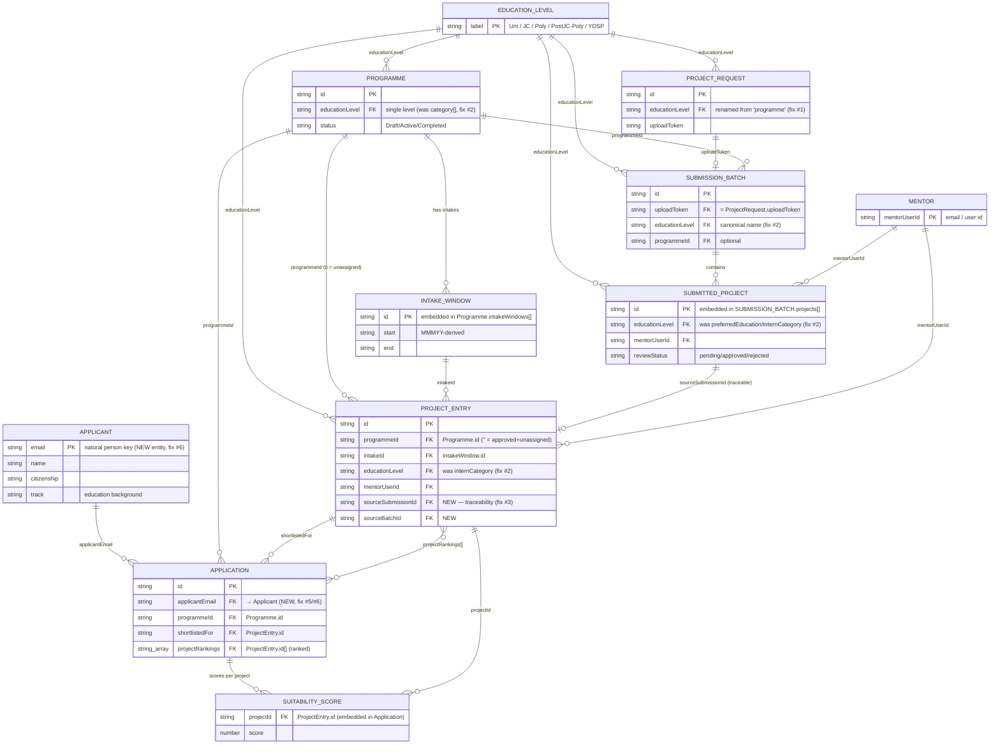

# DSTA Portal — Target Entity Model (to-be)

_The cleaned-up model the consolidation builds toward. Compare with the current state in
[ENTITY-MODEL.md](./ENTITY-MODEL.md). Each change maps to a numbered issue from that doc._

## Target ER Diagram

`MY_APPLICATION` is **removed** — the applicant-facing list becomes a projection of
`APPLICATION` filtered by `applicantEmail` (no separate stored array → no drift, fix #5).

## What changed vs current

| Fix | Change | Code impact | Breaking? |
|---|---|---|---|
| **#1** | `ProjectRequest.programme` → **`educationLevel`** | rename field + refs; migrate seed JSON | low — mechanical rename |
| **#2** | One canonical **`educationLevel: EducationLevel`** field on Programme / ProjectEntry / SubmittedProject / Batch / Request (replaces `category[]`, `internCategory`, `preferredEducation`) | rename + collapse `category[]`→single; keep `toEducationLevel()` only for legacy parsing | medium — touches matching/filtering |
| **#3** | `ProjectEntry` gains **`sourceSubmissionId` + `sourceBatchId`**; approval stops regenerating identity-only | set both in the single approval helper (P2) | low — additive fields |
| **#4** | Central **`archiveProject(id)`** scrubs refs in `Application.projectRankings[] / shortlistedFor / suitabilityScores[]` | one helper; replaces ad-hoc `projectArchived` patching | low — additive helper |
| **#5** | Drop stored `MyApplication`; derive applicant view from `Application` by `applicantEmail` | apply-form writes Application; applicant views filter | medium — changes apply flow |
| **#6** | New **`Applicant`** entity keyed by `email`; `Application.applicantEmail` FK; identity fields move to Applicant | new store `dsta_applicants`; Application slims to pipeline state | medium — biggest change |

## Field-naming standard (the canonical keys)

| Concept | Canonical field | Type | Used by |
|---|---|---|---|
| Education level | `educationLevel` | `EducationLevel` enum | Programme, ProjectEntry, SubmittedProject, Batch, Request |
| Programme link | `programmeId` | `string` (`''`=none) | ProjectEntry, Application, Batch |
| Intake link | `intakeId` | `string` | ProjectEntry |
| Project link | `projectId` / `*ProjectId` | `string` | Application refs, SuitabilityScore |
| Applicant link | `applicantEmail` | `string` | Application |
| Mentor link | `mentorUserId` | `string` | ProjectEntry, SubmittedProject |
| Submission trace | `sourceSubmissionId` / `sourceBatchId` | `string` | ProjectEntry |

## Sequencing (fold into the P1–P5 consolidation)

1. **P1 `lib/storage.ts`** — central seed versions + load/save. (No model change yet; removes the wipe bugs.)
2. **P2 approval helper** — apply **#3** (`sourceSubmissionId/BatchId`) while unifying the 3 approval paths.
3. **#1 + #2 rename pass** — `educationLevel` everywhere; collapse `category[]`. Do as one mechanical sweep + seed migration.
4. **#4 `archiveProject()`** — central ref-scrub.
5. **#6 `Applicant` + #5 drop MyApplication** — the largest change; do last, deliberately.
6. **Regenerate seed data** to satisfy the target keys.

> **Out of scope of the ERD (noted):** `Application` still has many lifecycle status fields
> (`status`, `eligibilityPass`, `mentorDecision`, `offerResponse`, clearances, request sub-statuses).
> That's domain complexity, not a key problem — document it as a separate **state machine** rather
> than forcing it into the entity model.
