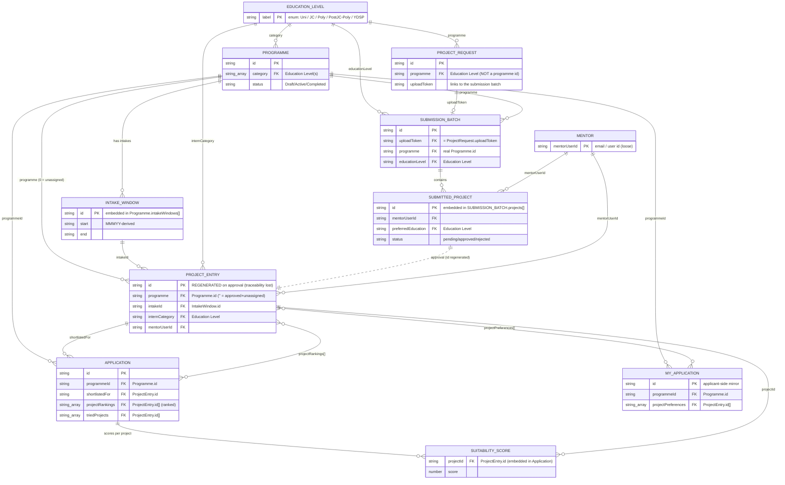

# DSTA Portal — Entity Relationship Model

_Derived from `lib/types.ts`. Shows the entities, their keys, and the fields that act
as foreign keys. All "FKs" are plain strings with no referential integrity — see Issues._

## ER Diagram



## Foreign-key table (the actual link fields)

| From entity | FK field | → To entity (key) | Cardinality | Notes |
|---|---|---|---|---|
| ProjectEntry | `programme` | Programme.id | N→1 (0 ok) | `''` = approved-but-unassigned |
| ProjectEntry | `intakeId` | IntakeWindow.id | N→1 | the specific intake its period falls within |
| ProjectEntry | `internCategory` | Education Level | N→1 | join dimension, not a table |
| ProjectEntry | `mentorUserId` | Mentor | N→1 | loose (email/user id) |
| Programme | `category[]` | Education Level | N→N | usually 1; combined "Post JC/Poly" = 2 raw values |
| Programme | `intakeWindows[].id` | IntakeWindow | 1→N | intakes embedded |
| ProjectRequest | `programme` | **Education Level** | N→1 | ⚠️ misnamed — NOT a programme id |
| ProjectRequest | `uploadToken` | SubmissionBatch.uploadToken | 1→1 | how a request is answered |
| SubmissionBatch | `programme` | Programme.id | N→1 | the real programme |
| SubmissionBatch | `educationLevel` | Education Level | N→1 | = the request's level |
| SubmittedProject | `mentorUserId` | Mentor | N→1 | |
| SubmittedProject | (approval) | ProjectEntry | 1→1 | ⚠️ **id regenerated** — no stored back-link |
| Application | `programmeId` | Programme.id | N→1 | |
| Application | `shortlistedFor` | ProjectEntry.id | N→1 | set on shortlist/interview |
| Application | `projectRankings[]` | ProjectEntry.id | N→N | ranked preference list (max 5) |
| Application | `triedProjects[]` | ProjectEntry.id | N→N | exhausted preferences |
| SuitabilityScore | `projectId` | ProjectEntry.id | N→1 | embedded in Application |
| MyApplication | `programmeId` | Programme.id | N→1 | applicant-side mirror of Application |
| MyApplication | `projectPreferences[]` | ProjectEntry.id | N→N | mirror of projectRankings |

## Issues this surfaces

1. **`ProjectRequest.programme` is an Education Level, not a programme** → rename to `educationLevel` so the FK reads true.
2. **Education Level is an unnamed join dimension** keyed by 5+ different field names (`category`, `internCategory`, `programme`, `educationLevel`, `preferredEducation`) → standardise on one canonical helper (`toEducationLevel`) and ideally one field name.
3. **Submission → ProjectEntry regenerates the id** → store `sourceSubmissionId` (or reuse the id) so a live project traces back to its submission/batch/request.
4. **No referential integrity** → archived/deleted projects leave dangling ids in `projectRankings[]`, `shortlistedFor`, `suitabilityScores[]`. The `projectArchived` field is a patch for this; a central "remove project ⇒ scrub refs" step would be cleaner.
5. **Application vs MyApplication** hold the same FKs (programmeId, project ids) and can drift → treat one as derived/projection of the other.
6. **No applicant entity** — applicant identity is inlined into Application (name/email) and duplicated in MyApplication; there's no `Applicant` keyed record tying a person's multiple applications together.
```
