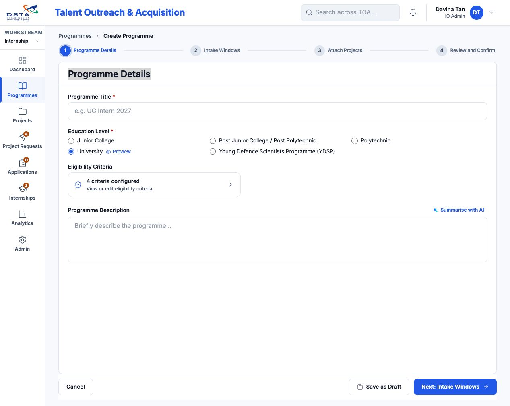
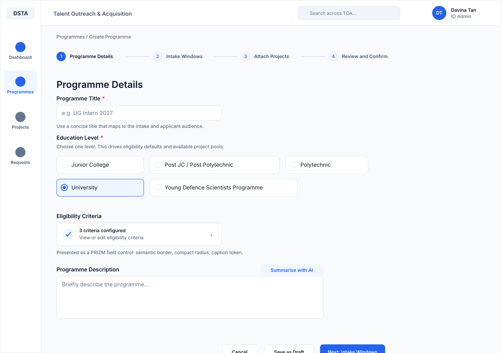
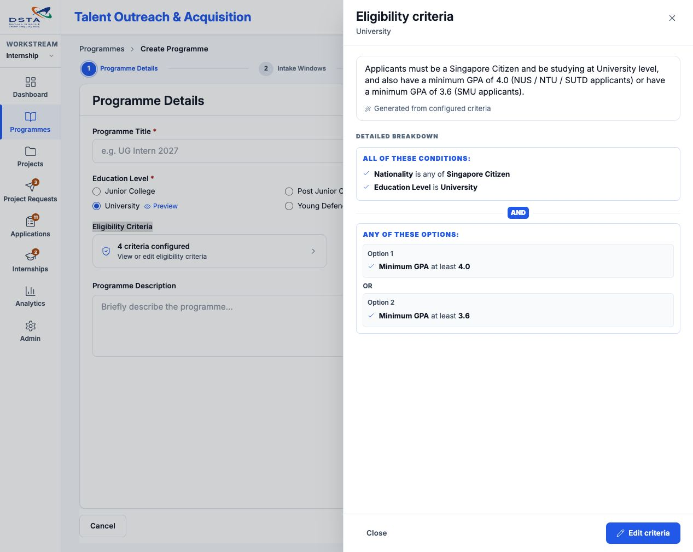
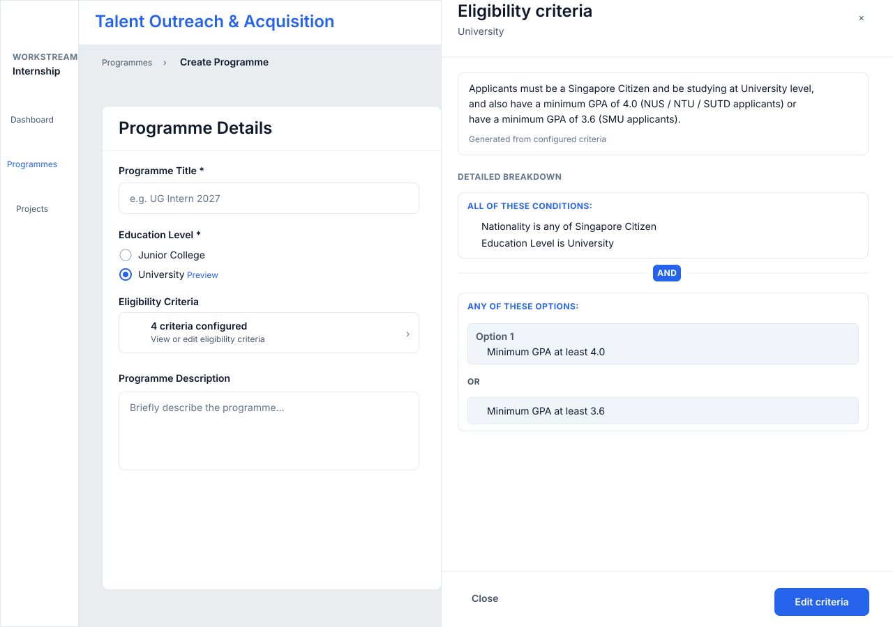

# Programme Details PRIZM 4 Compliance Audit

Date: 2026-06-29

Scope: `/programmes/new`, Step 1 `Programme Details`.

References:
- `docs/PRIZM.md`
- `docs/prizm4-page-rules.md`
- PRIZM components: https://prizm-design.github.io/prizm/components/
- PRIZM Sheet: https://prizm-design.github.io/prizm/components/sheet/
- PRIZM Card: https://prizm-design.github.io/prizm/components/card/
- Source: `views/programme-form.tsx`

## Current Screenshot



## Proposed PRIZM 4 Effect

Static mock showing the intended corrected direction. It is not an implementation screenshot yet.



## Eligibility Criteria Side Panel Check

### Before

Real screenshot captured after clicking the `Eligibility Criteria` summary row.



Findings:
- Summary panel used `rounded-xl`; PRIZM page rules prefer `rounded-md` or `rounded-lg` for Enterprise operational surfaces.
- The side panel was implemented with the page-local `Drawer`, so it did not use PRIZM `Sheet` motion, overlay, close, and focus behavior.
- Drawer footer text used arbitrary typography such as `text-[13px]`.
- Drawer section headings used arbitrary overline classes such as `text-[11px]`.
- Criteria Builder used page-local text sizes, a custom `all/any` segmented pill, and heavy panel framing inside the side panel.
- Detailed breakdown panels used accent-tinted borders (`border-accent/20`) for normal read-only content, which over-emphasized non-alert information.
- The read-only detail component still had page-local label styles (`text-[12px]`, custom uppercase treatment).
- The detailed breakdown used all-caps labels such as `ALL OF THESE CONDITIONS`, which does not match the intended side-panel reading tone.

### After

Source-aligned after-state mock for the implemented PRIZM 4 direction.



Implemented side-panel changes:
- The Eligibility Criteria side panel now uses PRIZM `Sheet`, `SheetContent`, `SheetHeader`, `SheetBody`, and `SheetFooter`, so the right-side slide transition follows the Sheet component contract.
- The eligibility summary panel now uses `rounded-lg`, `bg-surface`, and `border-border`.
- Generated-summary footer now uses `text-caption`.
- The `View criteria detail` action now uses the shared `Button` primitive with `variant="link"`.
- Side panel headings for `Criteria builder`, `Applicant preview`, and `Detailed breakdown` now use `text-label-sm` without forced uppercase.
- Side panel headings, logical connectors, and breakdown labels now use sentence case instead of all-caps styling.
- `Criteria builder` empty states, group panels, logical separators, helper text, and add actions now use `rounded-lg`, named typography tokens, `Input`, and shared `Button` variants.
- The `all/any` choice is now built from shared `Button` variants inside a small neutral segmented container instead of page-local button styling.
- Criteria group and option panels now use neutral `bg-surface` / `border-border` treatment with lighter dividers, reducing the blue-heavy card feel.
- `Applicant preview` narrative panels now use `rounded-lg` and named typography tokens.
- `ReqReadView` detail panels now use neutral `border-border bg-surface` rather than accent-tinted borders.
- `ReqReadView` logical separators and option labels now use named typography tokens without forced uppercase.
- Card usage was kept restrained: the side panel uses Sheet sections for layout, and only true grouped information remains visually framed. No nested or decorative Card composition was added.

Verification note:
- `/programmes/new` compiles and returns `200 OK` in the local Next.js dev server.
- The after-state figure above is a source-aligned visual mock rather than a browser screenshot. The source has been updated in `views/programme-form.tsx` and `components/ui/eligibility-read.tsx`.

## Summary

The page is directionally aligned with PRIZM 4 Enterprise Light: it uses semantic tokens, a restrained operational layout, and a progressive disclosure pattern for eligibility criteria. However, it is not fully PRIZM 4 compliant because several controls are still page-local implementations instead of PRIZM primitives, and several visual classes bypass PRIZM typography/radius conventions.

Estimated compliance: 75-85%.

## Implementation Update

Status: partially implemented in the current branch.

Updated files:
- `views/programme-form.tsx`
- `views/projects.tsx`
- `app/projects-v2/page.tsx`
- `components/layout/ia-rail.tsx`
- `components/ui/eligibility-read.tsx`
- `components/ui/month-year-picker.tsx`

Implemented changes:
- Programme Title now uses PRIZM `Field`, `FieldLabel`, `Input`, and `FieldError`.
- Education Level radio mode now uses PRIZM `RadioGroup` and `RadioGroupItem` instead of native radios with `accent-accent`.
- Education Level selected state now uses semantic tokens: `border-accent` and `bg-accent/5`.
- Eligibility Criteria summary control keeps the same drawer interaction but now uses restrained `rounded-lg`, compact `min-h-9`, and tokenized `text-caption`.
- Programme Description now uses PRIZM `Field`, `FieldLabel`, `Textarea`, and `FieldDescription`.
- `Summarise with AI` now uses the shared `Button` primitive with `variant="ghost"`.
- Sidebar typography was partially tokenized from arbitrary text sizes to `text-label-sm` / `text-nav-label`.
- Sidebar workstream dropdown radius was reduced from `rounded-xl` to `rounded-lg`.
- Sidebar warning badge foreground was changed from raw `text-white` to semantic `text-accent-fg`.
- Eligibility side-panel summary, applicant preview, and read-only detail surfaces were aligned to PRIZM tokens and restrained radius.
- Eligibility side-panel labels were changed to sentence case; all-caps overline treatment was removed from the side-panel content.
- Eligibility side panel now uses the PRIZM Sheet primitive instead of the page-local Drawer.
- Card usage in the side panel was reviewed against PRIZM Card guidance; ordinary section layout remains unframed, while grouped eligibility summaries/details keep simple neutral surfaces.
- The Programme wizard now combines separate intake and attachment steps into `Intake & Project Allocation`.
- Intake internship-period fields now use `MonthYearPicker` instead of long select menus.
- The month picker popover now renders through a portal with fixed positioning, so it is not clipped or covered by adjacent intake cards.
- Project allocation is intake-first: each intake shows assigned and suggested projects, with direct assign/remove actions.
- Projects can be manually assigned to one or more intakes through a dialog, and project periods can be edited from allocation warnings.
- The Projects page now separates work into `Pending Review`, `Project Pool`, `Allocated Projects`, and `Archived` tabs.
- Approved project requests move into the Project Pool, and newly approved projects are highlighted.
- `/projects-v2` now re-exports `views/projects` because `views/projects-v2.tsx` was removed.

Validation:
- `/programmes/new` returns `200 OK` after the changes.
- `/projects` returns `200 OK` after the changes.
- `tsc --noEmit` passes after fixing the `/projects-v2` wrapper.

Not changed in this pass:
- Thumbnail preview micro-illustrations inside Programme Details still contain tiny arbitrary visual classes. These are miniature document-art styling, not primary form controls.
- Some later wizard surfaces still contain older `text-[...]` and `rounded-xl` usages. The primary allocation path and eligibility drawer were prioritized in this pass.

## Non-Compliant Areas

| Area | Current issue | Why it misses PRIZM 4 | Recommended correction |
| --- | --- | --- | --- |
| Programme Title | Fixed | Now composed with PRIZM `Field` + `Input` primitives | Done |
| Education Level | Fixed for radio mode | Native radios with `accent-accent` were replaced by PRIZM `RadioGroup` / `RadioGroupItem` | Done |
| Eligibility Criteria | Fixed for summary control | Summary control now uses `rounded-lg`, `min-h-9`, semantic tokens, and `text-caption` | Done |
| Programme Description | Fixed | Now uses PRIZM `Textarea` under `Field` | Done |
| Summarise with AI | Fixed | Now uses shared `Button` primitive | Done |
| Typography | Partially fixed | Primary Programme Details controls, sidebar, and Eligibility Criteria drawer were tokenized; thumbnail micro-art and later wizard steps remain | Follow-up if stricter sweep is needed |
| Radius | Partially fixed | Primary summary control and sidebar dropdown were reduced to `rounded-lg`; later steps remain unchanged | Follow-up if expanding scope |

## Evidence From Current Source

Original source examples that drove the fix:

- `Programme Title`: `className="input w-full"`
- `Education Level`: `className="accent-accent w-4 h-4 shrink-0"`
- `Eligibility Criteria`: `className="... rounded-xl ..."`
- `Eligibility helper text`: `className="block text-[12px] text-fg-muted"`
- `Programme Description`: `className="input w-full resize-none"`

These have been addressed for the primary Programme Details form controls.

## Recommended Implementation Plan

1. Convert the form rows to PRIZM field composition. Done.
   - Use `Field` for label, helper text, and error text.
   - Use `Input` for Programme Title.
   - Use `Textarea` for Programme Description.

2. Replace Education Level native radios. Done for radio mode.
   - Use `RadioGroup` and `RadioGroupItem`.
   - Keep the current single-select behavior.
   - Preserve the existing education level values and validation.

3. Rebuild Eligibility Criteria as a PRIZM summary control. Done for the summary row.
   - Keep the existing click-to-open-drawer behavior.
   - Change `rounded-xl` to `rounded-lg`.
   - Replace `text-[12px]` with `text-caption` or `text-body-sm`.
   - Keep `ShieldCheck`, `ChevronRight`, `bg-surface`, `border-border`, `text-fg`, `text-fg-muted`, and `text-accent`.

4. Standardize secondary actions. Done for `Summarise with AI`.
   - Convert `Summarise with AI` to the shared `Button` primitive.
   - Use a subtle/ghost treatment with semantic token colors.

5. Run a PRIZM style sweep. Partially done for Programme Details primary controls and sidebar only.
   - Search target files for:
     ```bash
     rg "rounded-xl|text-\\[|accent-accent|#[0-9a-fA-F]|text-white|style=\\{\\{" views/programme-form.tsx components/layout
     ```
   - Replace page-local styling where it affects normal application UI.

## Expected Result

After the changes, Programme Details should still feel like the current page, but with tighter PRIZM alignment:

- Form controls use shared primitives.
- Radius is quieter and more Enterprise-like.
- Typography is tokenized.
- Eligibility Criteria remains a compact progressive disclosure control.
- The page becomes easier to maintain because visual decisions move out of page-local Tailwind strings.
